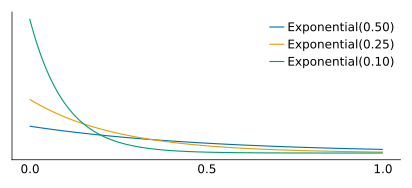

```{r setup, include=FALSE}
knitr::opts_chunk$set(echo = FALSE)
```
Based on the book by Box, Hunter, and Hunter: *Statistics for Experimenters* 

Chapter 3: Comparing Two Entities: Reference Distributions, Tests, and Confidence Intervals

# Introduction

In *Statistics for Experimenters* we are shown an example of comparing two methods in a chemical manufacturing plant in an attempt to understand if one method has a **significantly better** yield than the other. I will present the data and the original model and then we'll model this comparison using Bayesian methods.

#### Roadmap
1. The original question and the frequentist approach to comparing means
1. A Bayesian approach to the $t$-test
1. Summary of our analysis results and potential improvements

# The original question and the $t$-test

> An experiment was performed on a manufacturing plant by making *in sequence* $10$ batches of a chemical using a standard production method $(A)$ followed by $10$ batches using a modified method $(B)$. What evidence do the data provide that method $B$ gives higher yields than method $A$?

## Visualizing the data

```julia
using DataFrames, CairoMakie, Statistics

# prepare dataframe
time = 1:1:20
method = repeat(["A", "B"], inner = 10)
yield = [89.7, 81.4, 84.5, 84.8, 87.3, 79.7, 85.1, 81.7, 83.7, 84.5, 84.7, 86.1, 
83.2, 91.9, 86.3, 79.3, 82.6, 89.1, 83.7, 88.5]

data = DataFrame(time = time, method = method, yield = yield)
first(data, 5)
```

| time | method | yield |
| --- | --- | --- |
| 1 | A | 89.7 |
| 2 | A | 81.4 |
| 3 | A | 84.5 |
| 4 | A | 84.8 |
| 5 | A | 87.3 |

The averages are shown for both of the methods so we have a crude difference in yield of around $1.3$ between these two methods. But is this average difference due to random chance?

$$
\bar y_A = 84.24, \bar y_B = 85.54
$$

```julia
# plot attributes
CairoMakie.activate!(type = "svg")
set_theme!(theme_minimal())
fig = Figure(resolution = (650, 300))
ax = fig[1, 1] = Axis(fig, xlabel = "time", ylabel = "yield", xticks = 1:1:20)

# calculate the mean for each group
datagroup = groupby(data, :method)
datamean = transform(datagroup, :yield => mean)

methoda = datamean[datamean.method .== "A",:]
methodb = datamean[datamean.method .== "B",:]

# plot it out
scatter!(methoda.time, methoda.yield, label = "Process A")
lines!(methoda.time, methoda.yield_mean)
scatter!(methodb.time, methodb.yield, label = "Process B")
lines!(methodb.time, methodb.yield_mean)

fig[2,1] = Legend(fig, ax, framevisible = false, orientation = :horizontal)
fig
```


## The $t$-test results

Where the sample averages for each method are $\bar y_A$ and $\bar y_B$, the population difference is given as $\delta = \eta_B - \eta_A$, the pooled estimate of $\sigma$ is given as $s$, and the number of observations for each method are $n_A$ and $n_B$. Then we can calculate the $t$-statistic:

$$
t_0 = \frac{(\bar y_B - \bar y_A) - \delta_0}{s \sqrt{1 / n_B + 1 / n_A}}
$$

For the _null hypothesis_ we have $\delta_0 = 0, t_0 = 1.30/1.47 = 0.88$ with $\nu = 18$ degrees of freedom. Then we want the following for our significance level:

$$
\Pr(t \ge 0.88) = 19.5\%
$$

> This reference distribution assumes the random sampling model and the observed difference then has a significance probability of $19.5\%$ which would provide little evidence against the hypothesis that $\eta_B - \eta_A = 0$.

## Visualizing the $t$-test results

Scaling a $t$-distribution by the standard error of the difference between $\bar y_B$ and $\bar y_A$ and looking at the probability density that exists above our estimated mean difference of $1.3$ we can visualize the results of our test. Seeing approximately $19.5 \%$ of the probability mass above this difference:

```julia
using Distributions

# number of obs
n_a = nrow(methoda)
n_b = nrow(methodb)

# average yield per method
avg_a = mean(methoda.yield)
avg_b = mean(methodb.yield)
diff_ab = avg_b - avg_a

# sample variance
s2_a = sum((methoda.yield .- avg_a).^2)
s2_b = sum((methodb.yield .- avg_b).^2)

# degrees of freedom
nu = n_a + n_b - 2

# pooled estimate of σ^2
pools2 = (s2_a + s2_b) / nu

# estimated standard error of y_B - y_A
std_err = sqrt(pools2/5)

# t-statistic
tstat = diff_ab / std_err

# significance level
sig_level = 1 - cdf(TDist(nu), tstat)

# plotting attributes
fig2 = Figure(resolution = (600, 300))
ax2 = Axis(fig2[1, 1], title = "Scaled t-distribution")

# A scaled t-distribution by the standard error of y_B - y_A
scaled_dist = LocationScale(0.0, std_err, TDist(nu))

# get density line and clipped values
xs2 = -5:0.001:5
post_range = pdf.(scaled_dist, xs2)
post_clip = [x < diff_ab ? 0 : pdf(scaled_dist, x) for x in xs2] 

# plot
lines!(xs2, post_range)
band!(xs2, 0, post_clip)
vlines!(ax2, [diff_ab], color = :black, linestyle = :dash)
hideydecorations!(ax2)
fig2
```


# A Bayesian approach 
## Choosing our priors

Choosing our priors is the first step in this approach. Since we'll be modeling the average yield for each method I will begin by considering how *yield* is [defined](https://chem.libretexts.org/Courses/Sacramento_City_College/SCC%3A_CHEM_300_-_beginning_Chemistry/SCC%3A_CHEM_300_-_beginning_Chemistry_(Faculty)/08%3A_Quantities_in_Chemical_Reactions/8.06%3A_Limiting_Reactant%2C_Theoretical_Yield%2C_and_Percent_Yield_from_Initial_Masses_of_Reactants) and what that can tell us about its order of magnitude.

Percent yield is a measurement of how successful a chemical reaction has been:

> ...the __theoretical yield__, the maximum amount of product that can be formed from the given amounts of reactants. The __actual yield__ is the amount of product that is actually formed when the reaction is carried out in the laboratory. The __percent yield__ is the ratio of the actual yield to the theoretical yield, expressed as a percentage.
> $$
> \text{Percent Yield} = \frac{\text{Actual Yield}}{\text{Theoretical Yield}} \times 100\%
> $$

## Thinking in distributions

Considering that yield here is a _percentage_ I'd think a decent prior probability distribution for the average yield would be a _Beta_ distribution:

```julia
# plotting attributes
fig3 = Figure(resolution = (550, 250))
ax3 = Axis(fig3[1, 1])

beta_dist = Beta(1, 1)
beta_dist2 = Beta(2, 2)
beta_dist3 = Beta(2, 5)
	
# get density line and clipped values
xs3 = 0.:0.001:1
post_range2 = pdf.(beta_dist, xs3)
post_range3 = pdf.(beta_dist2, xs3)
post_range4 = pdf.(beta_dist3, xs3)
	
# plot
lines!(xs3, post_range2, label = "Beta(1, 1)")
lines!(xs3, post_range3, label = "Beta(2, 2)")
lines!(xs3, post_range4, label = "Beta(2, 5)")
hideydecorations!(ax3)
axislegend()
fig3
```


Since percent yield could reasonably be anywhere between $0$ and $1$ but with those outcomes being very unlikely I think a Beta(2, 2) is an adequate _weakly informative_ prior.

## Prior for the variance

We will be modeling the variance as being pooled between both methods: we will have two means but one shared variance. The variance must be positive and since our means are scaled between $[0,1]$ then the standard deviation should be close to this range.

```julia
# plotting attributes
fig4 = Figure(resolution = (550, 250))
ax4 = Axis(fig4[1, 1])

exp_dist = Exponential(.50)
exp_dist2 = Exponential(.25)
exp_dist3 = Exponential(.10)
	
# get density line and clipped values
xs4 = 0.:0.001:1.
prior_range = pdf.(exp_dist, xs4)
prior_range2 = pdf.(exp_dist2, xs4)
prior_range3 = pdf.(exp_dist3, xs4)
	
# plot
lines!(xs4, prior_range, label = "Exponential(0.50)")
lines!(xs4, prior_range2, label = "Exponential(0.25)")
lines!(xs4, prior_range3, label = "Exponential(0.10)")
hideydecorations!(ax4)
axislegend()
fig4
```




Given that the Exp(0.1) distribution is almost completely under $1$ it will be an adequate prior for $\sigma$.


## Our probability model

$\mu_A$ and $\mu_B$ are the estimated population means for each of the methods and they have a shared variance term $\sigma^2$. The priors for these are the following:

$$
\begin{aligned}
&\mu_A \sim \text{Beta}(2,2) \\
&\mu_B \sim \text{Beta}(2,2) \\
&\sigma \sim \text{Exp}(0.10) 
\end{aligned}
$$

The likelihood is broken into two parts for each of the methods:

$$
\begin{aligned}
&y_A \sim \text{Normal}(\mu_A, \sigma) \\
&y_B \sim \text{Normal}(\mu_B, \sigma)
\end{aligned}
$$

## MCMC and Metropolis sampling

Multiplying Beta and Exponential priors with a Normal likelihood results in a non-conjugate case. So in this example it may make more sense to utilize Markov Chain Monte Carlo (MCMC) methods to estimate our joint probability model. 

_Markov Chain Monte Carlo_ gets part of its name from the _Markov property_:

> _Given the present, the future is independent of the past._

I decided to implement the _Metropolis_ algorithm as a pedagogical exercise below but I'd definitely recommend using probabilistic programming languages like [Stan](https://mc-stan.org), [Turing](https://turing.ml/stable/), or [PyMC](https://docs.pymc.io/en/v3/) in practice.

Using the Metropolis algorithm to sample the target distribution and removing _burn-in_ samples results in the following summary for our parameters:

```julia
methoda_yield = methoda.yield / 100
methodb_yield = methodb.yield / 100

function likelihood(param)
	mu1 = param[1]
	mu2 = param[2]
	sd = param[3]
	
	singlelike1 = logpdf.(Normal(mu1, sd), methoda_yield)
	singlelike2 = logpdf.(Normal(mu2, sd), methodb_yield)
	singlelikelihood = vcat(singlelike1, singlelike2)
	sumll = sum(singlelikelihood)
	
	return(sumll)
end
	
function prior(param)
	mu1 = param[1]
	mu2 = param[2]
	sd = param[3]
	mu1prior = logpdf(Beta(2,2), mu1)
	mu2prior = logpdf(Beta(2,2), mu2)
	sdprior = logpdf(Exponential(0.10), sd)
	return(mu1prior + mu2prior + sdprior)
end
	
function posterior(param)
	return likelihood(param) + prior(param)
end
	
function proposalfunction(param)
	# enforced positive support but not sure how other PPLs enforce this
	return abs.(rand(MvNormal(param, [0.001 0 0; 0 0.001 0; 0 0 0.0005])))
end
	
function run_metropolis_MCMC(startvalue, iterations)
	chain = Array{Float64,2}(undef, iterations + 1, 3)
	chain[1,:] = startvalue
	
	for i in 1:iterations
		proposal = proposalfunction(chain[i,:])
		probab = exp(posterior(proposal) - posterior(chain[i,:]))
		r = min(1, probab)
		
		if rand(Uniform()) <= r
			chain[i+1,:] = proposal
		else
			chain[i+1,:] = chain[i,:]
		end
	end
	return chain
end
	
startvalue = [0.7, 0.7, 0.1]
chain_length = 100_000

using Random:seed!
seed!(555)
chain = run_metropolis_MCMC(startvalue, chain_length)	

burnIn = convert(Int, chain_length / 2)
chain1 = last(chain[:,1], burnIn)
chain2 = last(chain[:,2], burnIn)
chain3 = last(chain[:,3], burnIn)

DataFrame(
	mu_a = mean(chain1),
	mu_astd = std(chain1),
	mu_b = mean(chain2),
	mu_bstd = std(chain2),
	sigma = mean(chain3),
	sigma_std = std(chain3)
)
```

| mu_a | mu_astd | mu_b | mu_bstd | sigma | sigma_std |
| --- | --- | --- | --- | --- | --- |
| 0.841692 | 0.0112674 | 0.854442 | 0.0113898 | 0.0352205 | 0.00627626|

## Burn-in 
After utilizing MCMC to sample this model we should throw away some portion of our chain. A rule-of-thumb for Metropolis sampling is to only use half of your total samples and consider the first half the _burn-in_ (exploratory) phase and discard those samples.

```julia
figs = Figure(resolution = (800, 400))
ga = figs[1, 1] = GridLayout()
gb = figs[2, 1] = GridLayout()
gc = figs[3, 1] = GridLayout()
axs1 = Axis(ga[1, 1])
axs2 = Axis(gb[1, 1])
axs3 = Axis(gc[1, 1])
	
lines!(axs1, 1:1:(chain_length+1), chain[:,1])
lines!(axs2, 1:1:(chain_length+1), chain[:,2])
lines!(axs3, 1:1:(chain_length+1), chain[:,3])
vspan!(axs1, [0, chain_length/2], [0, 1], color = (:gray, 0.2))
vspan!(axs2, [0, chain_length/2], [0, 1], color = (:gray, 0.2))
vspan!(axs3, [0, chain_length/2], [0, 1], color = (:gray, 0.2))
Label(ga[1, 1, Top()], L"\mu_A", valign = :bottom, textsize = 20)
Label(gb[1, 1, Top()], L"\mu_B", valign = :bottom, textsize = 20)
Label(gc[1, 1, Top()], L"\sigma", valign = :bottom, textsize = 20)
hidexdecorations!.((axs1, axs2))
figs
```


## Samples from the joint distribution

Here are the marginal distributions for each of our estimated parameters:


```julia
figs2 = Figure(resolution = (1920/2, 1080/2))
ga2 = figs2[1, 1] = GridLayout()
gb2 = figs2[2, 1] = GridLayout()
gc2 = figs2[3, 1] = GridLayout()
axs11 = Axis(ga2[1, 1])
axs21 = Axis(gb2[1, 1])
axs31 = Axis(gc2[1, 1])

hist!(axs11, chain1)
hist!(axs21, chain2)
hist!(axs31, chain3)
linkxaxes!(axs11, axs21)
xlims!(axs31, (0.0, 0.1)) 
hideydecorations!.((axs11, axs21, axs31))
Label(ga2[1, 1, Top()], L"\mu_A", valign = :bottom, textsize = 30)
Label(gb2[1, 1, Top()], L"\mu_B", valign = :bottom, textsize = 30)
Label(gc2[1, 1, Top()], L"\sigma", valign = :bottom, textsize = 30)
figs2
```


## Comparing the means using samples

Now that we have samples for the mean of both methods how can we compare them? Simply by taking a difference of the samples we will get a distribution comparing the two means.

What's gained from this approach is that we can now see the probability of method $B$ having an increased yield to method $A$. Seeing how many samples are above $0$ and then taking the average of those results shows that $80\%$ of the probability mass is above zero.

```julia
meandiff = (chain2 - chain1) * 100
# @show probgt0 = mean(meandiff .> 0) # just for checking

fig5 = Figure(resolution = (550, 250))
ax5 = Axis(fig5[1, 1], title = L"\Pr(\mu_B - \mu_A \geq 0) = 80 %")
density!(meandiff, bandwidth = 0.4, color =(:grey, 0.5), strokewidth=1)
vlines!(ax5, [0.0], color = :black, linestyle = :dash)
xlims!(-8, 8)
hideydecorations!(ax5)
fig5
```


# Analysis results and improvements

## Summary of results
The frequentist $t$-test approach results in a _non-significant_ value. We fail to reject our null hypothesis that these samples come from a single _common_ population distribution.

The bayesian approach gives us an $80 \%$ probability that method $B$ improves overall yield compared to method $A$. 

In a business context I could see the bayesian result being far more useful than failing to reject our null hypothesis. A company can weigh their options between method $B$ and method $A$. Decide on what's more economical and have some percentage to wrap their heads around about potential improvement.

## Potential Improvements

This particular example was given in the text by Box, Hunter, and Hunter to demonstrate a case where the $t$-test may be an inappropriate statistical test. The $t$-distribution may be a poor choice for a _reference_ distribution. The reason why this is the case is due to autocorrelation and Student's $t$ test assuming errors are independent and identically distributed (iid).

The exact reason behind the correlated errors was given:

> In this particular process the yield was determined by measuring the volume of liquid product in each successive batch, but because of the design of the system, a certain amount of product was left in the pipes and pumps at each determination. Consequently, if slightly less was pumped out on a particular day, the recorded yield would be low but on the following day it would tend to be high... __Such an effect would produce a negative correlation between successive yields such as that found__.

Moving forward we should account for this and attempt to model the autocorrelation that exists between successive yields.


