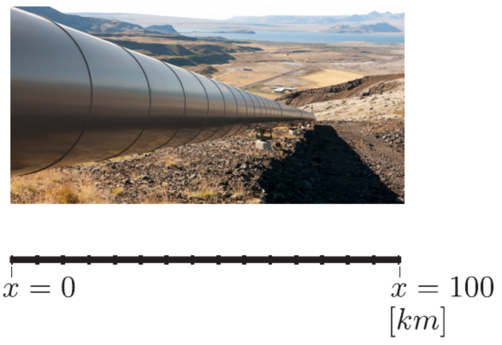
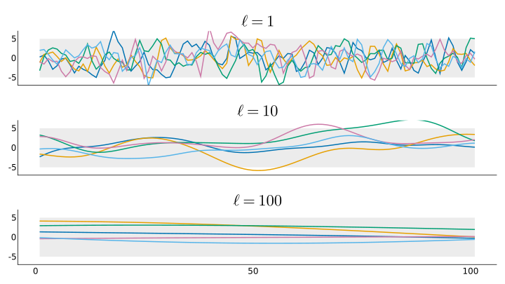
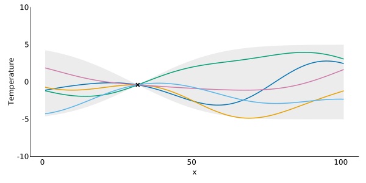
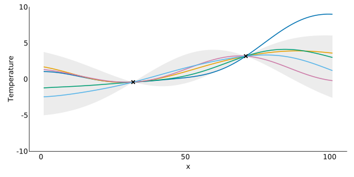
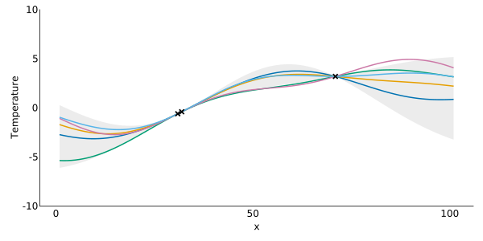
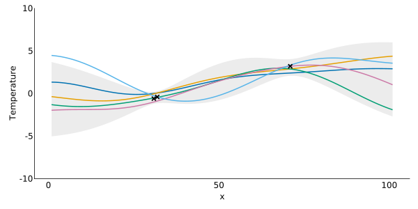
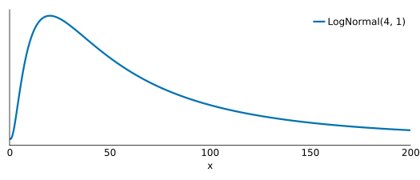
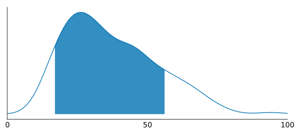

```{r setup, include=FALSE}
knitr::opts_chunk$set(echo = FALSE)
```

Based on the book by James-A Goulet: *Probabilistic Machine Learning for Civil Engineers* 

## Introduction

A Gaussian process regression is a _non-parametric_ bayesian approach to regression modeling. With it we're able to relax some of the assumptions of linear regression and model more complex relationships. This post works through an example of modeling the temperature of a pipeline at specific locations along the pipeline: $x$ km.

{width=70% .external}   

#### Roadmap
1. Our modeling example and Gaussian process regression
1. Our prior knowledge
1. Our posterior knowledge
1. Observation error
1. Parameter estimation


## Pipeline Example
> Take for example the $100$ km long pipeline illustrated below, for which we are interested in quantifying the temperature at any coordinate $x \in (0,100)$ km. Given that we know the pipeline temperature to be $y=8^\circ C$ at $x= 30$ km, what is the temperature at $x= 30.1$ km ? Because of the proximity between the two locations, it is intuitive that the temperature has to be close to $8^\circ C$. Then, what is the temperature at $x = 70$ km? We cannot say for sure that it is going to be around $8^\circ C$ because over a $40$ km distance, the change in temperature can reach a few degrees.

```julia
using DataFrames, CairoMakie

data = DataFrame(x = [31.0, 70, 30], temperature = [-0.4, 3.2, -0.6])
data
```

x |  temperature |
 --- | --- |
 31.0 | -0.4 | 
 70.0 | 3.2 |
 30.0 | -0.6 |

## Gaussian Process Regression

> A Gaussian process is a multivariate Normal random variable defined over a domain described by covariates.

### GP: mathematical formulation

In linear regression our observation model is the following and our observed covariates $x$ are assumed to be exact and free of observation error. The model is 	$g(x) = b_0 + b_1 x$ when using a linear basis function.

$$
\underbrace{y}_{\text{observation}} = \overbrace{g(x)}^{\text{model}} + \underbrace{v, v: V \sim \mathcal N(v; 0, \sigma_V^2)}_{\text{observation error}}
$$

In Gaussian process regression our observation model is the following where rather than having a mean and a covariance matrix we have a mean _function_ and covariance _function_.

$$
\underbrace{g_i}_{\text{observation}} = \overbrace{g(x_i)}^{\text{model}}
$$

Where the Gaussian process $g(\mathbf{x}): \mathbf{G(x)} \sim \mathcal N(g(\mathbf{x}); \mathbf{\mu_G, \Sigma_G})$ and $\mathbf {\mu_G}$ is the mean vector $[\mathbf{\mu_G}]_i = \mathbf{\mu_G}(x_i)$ and the covariance matrix $\mathbf {\Sigma_G}$ is: $[\mathbf{\Sigma_G}]_{ij} = \rho(x_i, x_j) \cdot \sigma_G(x_i) \cdot \sigma_G(x_j)$

### The Kernel

A Gaussian process regression is a _kernel_ regression. Where the _kernel_ is a function that relates our covariates pairwise by distance. Our predictions combine our observations with weights that depend on observed and predicted input locations. This kernel function was seen above as $\rho(x_i, x_j)$ in defining our covariance matrix $\mathbf{\Sigma_G}$.

In this example we will use the _square exponential_ function as our kernel function:

$$
\rho(x_i, x_j) = \exp \left (-\frac{1}{2} \frac{(x_i - x_j)^2}{\mathcal \ell^2} \right)
$$

What's seen in the denominator is our _length-scale_, $\ell$, which is a _hyperparameter_ (yes there are some parameters in this non-parametric approach) for the Gaussian process and describes a decay of correlation between the covariates. 

In our example this could be seen as how much does the temperature at position $x_i$ tell us about the temperature at position $x_j$? If they are $1$km apart vs being $100$km apart how much correlation should exist between the two points?

```julia
# define our kernel function
function square_exp(xi, xj; length_scale = 25.0) 
	return exp(-1/2 * (xi - xj)^2/length_scale^2)
end
	
# our covariate: distance
x = 0:1:100 
	
# covariance matrix under different length-scales
cov_mat1 = square_exp.(x, x', length_scale = 1.0) * 2.5^2
cov_mat2 = square_exp.(x, x', length_scale = 10.0) * 2.5^2
cov_mat3 = square_exp.(x, x', length_scale = 100.0) * 2.5^2
```

## Prior knowledge

Our prior knowledge in this example is the following:

$$
\underbrace{\mathbf {G \sim \mathcal N(g(x); \mu_G, \Sigma_G)}}_{\text{prior knowledge}}, [\mathbf{\Sigma_G}]_{ij} = \rho(x_i, x_j) \sigma_G^2
$$

The prior mean and standard deviations are assumed to be:
- mean prior $\mu_G = 0$
- our scale parameter $\sigma_G = 2.5 ^\circ C$

With this info we can begin by sampling realizations from our Gaussian process prior under different length-scales.

### Prior sampling and length-scales

```julia
using Distributions, LinearAlgebra, Colors
	
# add jitter to diagonal for linalg stability
d1 = MvNormal(cov_mat1 + 1e-10*I) 
d2 = MvNormal(cov_mat2 + 1e-10*I)
d3 = MvNormal(cov_mat3 + 1e-10*I)
	
# obtain realizations from different length-scale
realizations1 = rand(d1, 5)'
realizations2 = rand(d2, 5)'
realizations3 = rand(d3, 5)'
	
	# define some colors for our plot
function wongcolors()
    return [
		RGB(0/255, 114/255, 178/255), # blue
        RGB(230/255, 159/255, 0/255), # orange
        RGB(0/255, 158/255, 115/255), # green
    	RGB(204/255, 121/255, 167/255), # reddish purple
        RGB(86/255, 180/255, 233/255), # sky blue
        RGB(213/255, 94/255, 0/255), # vermillion
        RGB(240/255, 228/255, 66/255), # yellow
		]
end

# plot attributes
CairoMakie.activate!(type = "svg")
set_theme!(theme_minimal())
# plot
figs1 = Figure(resolution = (1920/2, 1080/2))
ga2 = figs1[1, 1] = GridLayout()
gb2 = figs1[2, 1] = GridLayout()
gc2 = figs1[3, 1] = GridLayout()
axs11 = Axis(ga2[1, 1])
axs21 = Axis(gb2[1, 1])
axs31 = Axis(gc2[1, 1])
band!(axs11, x .+ 1, -5, 5, color = (:gray90, 0.7))
band!(axs21, x .+ 1, -5, 5, color = (:gray90, 0.7))
band!(axs31, x .+ 1, -5, 5, color = (:gray90, 0.7))
series!(axs11, realizations1, color = wongcolors())
series!(axs21, realizations2, color = wongcolors())
series!(axs31, realizations3, color = wongcolors())
linkyaxes!(axs11, axs21, axs31)
ylims!(axs31, (-7, 7)) 
hidexdecorations!.((axs11, axs21))
Label(ga2[1, 1, Top()], L"\ell = 1", valign = :bottom, textsize = 30)
Label(gb2[1, 1, Top()], L"\ell = 10", valign = :bottom, textsize = 30)
Label(gc2[1, 1, Top()], L"\ell = 100", valign = :bottom, textsize = 30)
figs1
```



## Posterior knowledge

Now if we introduce data, $\mathcal D$, then we can obtain the _posterior_ PDF $f(\mathbf{g_* | x_*}, \mathcal D)$. Our prior knowledge changes given that we have new observed $\mathbf{x}$ locations and prediction locations: $\mathbf{x_*}$

$$
\left[\begin{array}{c} \mathbf{G} \\ \mathbf{G}_{*} \end{array}\right]
\sim
\mathcal{N} \left(
\left[\begin{array}{c} \mu_{G} \\ \mu_{*} \end{array}\right],
\left[ \begin{array}{cc}
\Sigma_{G} & \Sigma_{G*} \\
\Sigma_{G*}^T & \Sigma_{*}
\end{array} \right]
\right)
$$

Where $\mathbf{\Sigma_G}$ is our kernel function comparing our observed $\mathbf x$ locations against other observed $\mathbf x$ locations and $\mathbf{\Sigma_*}$ is the kernel function comparing predicted $\mathbf{x_*}$ locations against other predicted $\mathbf{x_*}$ locations. The $\mathbf{\Sigma_{G*}}$ matrix is the cross-covariance between predicted and observed locations.

With this prior information we can condition on the data $\mathcal D$ and obtain the posterior PDF $f(\mathbf{g_* | x_*}, \mathcal D) = \mathcal N(\mathbf{g_*}; \mathbf{\mu}_{\mathbf * | \mathcal D}, \mathbf \Sigma_{\mathbf * | \mathcal D})$ analytically where the posterior mean and covariance are:

$$
\begin{aligned}
\mathbf \mu_{\mathbf *|\mathcal D} &= \mathbf{\mu_{G_*} + \Sigma_{G*}^T \Sigma{_G}^{-1}(g - \mu_G)} =  \mathbf{\Sigma_{G*}^T \Sigma{_G}^{-1} g}\\
\mathbf \Sigma_{\mathbf *|\mathcal D} &= \mathbf{\Sigma_* - \Sigma_{G*}^T \Sigma{_G}^{-1} \Sigma_{G*}}
\end{aligned}
$$

```julia
function gp(x_obs, x_pred, y_obs, σ_g)
	# do the matrix algebra to get our posterior distribution
    ΣG = square_exp.(x_obs, x_obs') * σ_g^2
    ΣG_star = square_exp.(x_obs, x_pred') * σ_g^2
    solved = ΣG \ ΣG_star

    μ_post = vec(solved' * y_obs)
    Σ_star = square_exp.(x_pred, x_pred') * σ_g^2
    Σ_post = Σ_star - (solved' * ΣG_star)

    return μ_post, Σ_post
end
```

### $n=1$

```julia
# get our realizations
gp_μ1, gp_Σ1 = gp(data.x[1], x, data.temperature[1], 2.5)
post1 = MvNormal(gp_μ1, Matrix(Hermitian(gp_Σ1 + 1e-10I)))
post_real = rand(post1, 5)'
σ2 = sqrt.(diag(gp_Σ1))

# plot attributes
fig21 = Figure(resolution = (800, 400))
ax21 = fig21[1, 1] = Axis(fig21, xlabel = "x", ylabel = "Temperature")
ylims!(ax21, (-10, 10)) 

# plot
band!(x .+ 1, gp_μ1-2*σ2, gp_μ1+2*σ2, color = (:gray90, 0.7))
series!(post_real, color = wongcolors())
scatter!(data.x[1:1] .+ 1, data.temperature[1:1], marker = :xcross, markersize = 15, color = :black)
fig21
```




### $n=2$

```julia
# get our realizations
gp_μ2, gp_Σ2 = gp(data.x[1:2], x, data.temperature[1:2], 2.5)
post2 = MvNormal(gp_μ2, Matrix(Hermitian(gp_Σ2 + 1e-10I)))
post_real2 = rand(post2, 5)'
σ22 = sqrt.(diag(gp_Σ2))

# plot attributes
fig22 = Figure(resolution = (800, 400))
ax22 = fig22[1, 1] = Axis(fig22, xlabel = "x", ylabel = "Temperature")
ylims!(ax22, (-10, 10)) 

# plot
band!(x .+ 1, gp_μ2-2*σ22, gp_μ2+2*σ22, color = (:gray90, 0.7))
series!(post_real2, color = wongcolors())
scatter!(data.x[1:2] .+ 1, data.temperature[1:2], marker = :xcross, markersize = 15, color = :black)
fig22
```




### $n=3$

```julia
# get our realizations
gp_μ3, gp_Σ3 = gp(data.x, x, data.temperature, 2.5)
post3 = MvNormal(gp_μ3, Matrix(Hermitian(gp_Σ3 + 1e-10I)))
post_real3 = rand(post3, 5)'
σ23 = sqrt.(diag(gp_Σ3))

# plot attributes
fig23 = Figure(resolution = (800, 400))
ax23 = fig23[1, 1] = Axis(fig23, xlabel = "x", ylabel = "Temperature")
ylims!(ax23, (-10, 10)) 

# plot
band!(x .+ 1, gp_μ3-2*σ23, gp_μ3+2*σ23, color = (:gray90, 0.7))
series!(post_real3, color = wongcolors())
scatter!(data.x .+ 1, data.temperature, marker = :xcross, markersize = 15, color = :black)
fig23
```




## Observation error

Until this point we have assumed that our observations are perfect and without any error. That they are the _exact_ temperature at the observed locations. However, we know that sensors have some instrument precision and we'd like to include that uncertainty in our model. Our model formulation becomes:

$$
\underbrace{y}_{\text{observation}} = \overbrace{g(x)}^{\text{model}} + \underbrace{v}_{\text{measurement error}}
$$

Where $v: V \sim \mathcal N(v; 0, \sigma_{V}^2)$. We have new prior knowledge so have to include the observation error:

$$
\left[\begin{array}{c} \mathbf{Y} \\ \mathbf{G}_{*} \end{array}\right]
\sim
\mathcal{N} \left(
\left[\begin{array}{c} \mu_{Y} \\ \mu_{G*} \end{array}\right],
\left[ \begin{array}{cc}
\Sigma_{Y} & \Sigma_{Y*} \\
\Sigma_{Y*}^T & \Sigma_{*}
\end{array} \right]
\right)
$$

We can reuse much of what was done before but model the noise by adding it to the covariance kernel of our observations $\mathbf \Sigma_G$. It is added along the diagonal using the identity matrix $\mathbf I$:

$$
\mathbf \Sigma_Y = \mathbf \Sigma_G + \sigma_{V}^2 \mathbf I = \rho(\mathbf x, \mathbf{x'}) + \sigma_{V}^2 \mathbf I
$$

### Assuming $\sigma_V = 0.5$

```julia
function gp_noise(x_obs, x_pred, y_obs, σ_g, σ_v)
	ΣY = square_exp.(x_obs, x_obs') * σ_g^2 + (σ_v^2 * Matrix(I, 3, 3))
    ΣY_star = square_exp.(x_obs, x_pred') * σ_g^2
    solved = ΣY \ ΣY_star

    μ_post = vec(solved' * y_obs)
    Σ_star = square_exp.(x_pred, x_pred') * σ_g^2
    Σ_post = Σ_star - (solved' * ΣY_star)

    return μ_post, Σ_post
end

μ2_noise, Σ2_noise = gp_noise(data.x, x, data.temperature, 2.5, 0.5);

post_noise = MvNormal(μ2_noise, Matrix(Hermitian(Σ2_noise + 1e-10I)))
post_real_noise = rand(post_noise, 5)'
σ2_noise = sqrt.(diag(Σ2_noise))

# plot attributes
fig3 = Figure(resolution = (800, 400))
ax3 = fig3[1, 1] = Axis(fig3, xlabel = "x", ylabel = "Temperature")
ylims!(ax3, (-10, 10)) 

# plot
band!(x .+ 1, μ2_noise - 2*σ2_noise, μ2_noise +2*σ2_noise, color = (:gray90, 0.7))
series!(post_real_noise, color = wongcolors())
scatter!(data.x .+ 1, data.temperature, marker = :xcross, markersize = 15, color = :black)
fig3
```




## Parameter estimation

Although Gaussian process regression is a nonparametric regression method we have come across a few parameters so far that we can consider _hyperparameters_ because they are all parameters of the prior. So far these are the following:

$$
\mathbf{\theta} = [\ell, \sigma_G, \sigma_V]^T
$$

Where $\ell$ is our length-scale in the kernel function, $\sigma_G$ is the gaussian process prior standard deviation or scale, and $\sigma_V$ is the observation standard deviation.

Our conditional distribution before was solved analytically when we fixed $\mathbf \theta$ assuming each of them were known. If we wanted to estimate these parameters from our data we could use maximum likelihood (MLE) or Markov chain Monte Carlo (MCMC) methods.

### Prior for our length-scale: $\ell$

The length-scale is more intuitive as a positive number and we can think of it in our units of distance (kilometers) in this example. When we have a length-scale around $100$ then we have almost parallel lines from $0$ to $100$ km. In our example it doesn't align with intuition to say that the temperature at either end of the pipeline should be correlated as highly as locations closer to each other. So we will give more weight to lower length-scales.

```julia
expvar = [pdf(LogNormal(4, 1), x) for x in 0:0.01:200]
fp = Figure(resolution = (700, 300))
axp = fp[1, 1] = Axis(fp, xlabel = "x")
lines!(axp, 0:0.01:200, expvar, linewidth = 3, label = "LogNormal(4, 1)")
xlims!(axp, (0, 200))
hideydecorations!(axp)
axislegend()
fp
```




### Estimating our length-scale 

Assuming that $\sigma_G = 2.5 ^\circ C$ and $\sigma_V = 0.5$ as we did before but this time we want to use the data to estimate our length-scale $\ell$ we have:

$$
\begin{align*}
\ell &\sim \text{LogNormal}(4, 1) \\
\Sigma &= \rho(\mathbf{x}, \mathbf{x'}, \ell) \cdot \sigma_{G}^2 \\
f &\sim \text{GP}(0, \Sigma) \\
y_{n} &\sim \mathcal N(f(x_{n}), \sigma_V)
\end{align*}
$$

A limitation of this modeling procedure that I ran into rather quickly is that building the matrices described above and attempting to use MCMC was too computationally intensive. Estimating the single $\ell$ parameter required the estimation of $100$ other parameters $f$ for each location and the simpler MCMC methods would not converge.

Due to this limitation it's common in practice to use approximate methods instead of full bayes when the number of observations exceed $1000$.

```julia
using Turing, FillArrays

@model function myGPnoncent(y, x)
    # priors
    length_par ~ LogNormal(4, 1)
    # covariance matrix
    cov_mat = square_exp.(x, x', length_scale = length_par) * 2.5^2 + 1e-10*I
    L_cov = cholesky(Symmetric(cov_mat)).L
	
    # non-centered param
    m ~ Normal()
    f_tilde ~ MvNormal(Fill(m, length(x)), 0.5 + I * 1e-10)
    f_predict = L_cov * f_tilde
	
    # likelihood
    y ~ MvNormal(f_predict[[32, 71, 31]], 0.5 + I * 1e-10)
end

x = 0:1:100
gpmod = myGPnoncent(data.temperature, x)
chain = sample(gpmod, NUTS(0.65), 200)
```

### Marginal distribution of $\ell$

Including $80 \%$ highest posterior density (HPD) region:

```julia
using KernelDensity

post_length = vcat(chain[Symbol("length_par")]...)

function hpdi(x::Vector{T}; alpha=0.11) where {T<:Real}
	n = length(x)
    m = max(1, ceil(Int, alpha * n))

	y = sort(x)
    a = y[1:m]
    b = y[(n - m + 1):n]
    _, i = findmin(b - a)
	return [a[i], b[i]]
end
	
hpdi_range = hpdi(post_length, alpha = 0.2)
	
# get index of hpdi range
k = kde(post_length)
min_idx = findall(x -> x >= hpdi_range[1], k.x) |> minimum
max_idx = findall(x -> x <= hpdi_range[2], k.x) |> maximum

# plot
fig5 = Figure(resolution = (650, 300))
ax5 = fig5[1, 1] = Axis(fig5)
lines!(ax5, k)
band!(ax5, k.x[min_idx:max_idx], 0.0, k.density[min_idx:max_idx])
hideydecorations!(ax5)
xlims!(ax5, (0, 100))
fig5
```




## Summary and next steps

The Gaussian process regression is a useful approach to modeling nonlinear relationships and exploiting the relationships between the covariates. In my opinion it strikes a balance between parametric and nonparametric methods like linear regression and neural networks/tree-based methods respectively. 

Compared to linear regression, it does a better job at modeling uncertainty in interpolation/extrapolation and its extrapolation is more predictable than other methods like linear regression with polynomial basis covariates. Some other limitations of linear regression that this approach can handle better are the expectation of homoscedastic errors and sensitivity to outliers.

In practice when building a Gaussian process and utilizing full bayes it's almost a necessity to use linear algebra tricks like cholesky decomposition of the covariance matrices and non-centered parameterizations to make the estimation procedure more efficient. 

I'm unsure if using MCMC is the way to go with these methods and perhaps reviewing the approximate methods landscape would be beneficial. Particularly of interest to me is the [laGP: Local Approximate Gaussian Process Regression](https://cran.r-project.org/web/packages/laGP/index.html) R package implementation.


